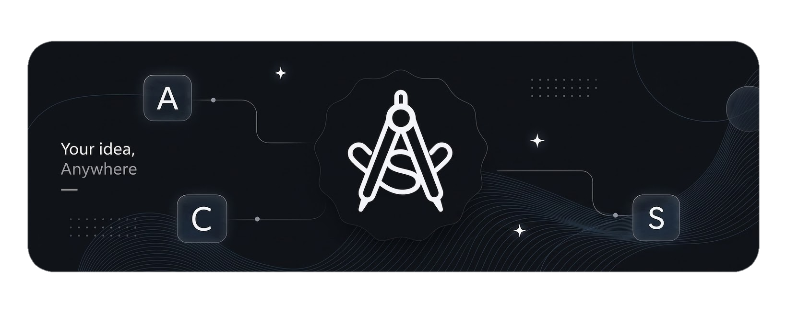

<picture>
  <source media="(prefers-color-scheme: light)" srcset="assets/art/acsart-light.png">
  <source media="(prefers-color-scheme: dark)" srcset="assets/art/acsart-dark.png">
  
</picture>

<h1 align="center">ACSIDE</h1>

  
  
  

AndroidCS IDE is a full-featured development environment designed for creating and managing all types of Android projects directly on-device or on lightweight systems. It provides a powerful yet efficient workflow for developers who want a complete Android development experience without the heavy requirements of traditional IDEs.

<table>
  <tr>
    <td><b>Who it is for</b></td>
    <td>Developers who want a full IDE on Android</td>
  </tr>
  <tr>
    <td><b>What you can build</b></td>
    <td>Android apps, libraries, Flutter apps, native modules</td>
  </tr>
</table>

---

> [!WARNING]
> **Use official downloads only**
>
> Install AndroidCS IDE from:
> - **GitHub Release** - https://github.com/AndroidCSIDE/ACSIDE/releases
>
> Avoid downloading APKs from unknown or unofficial websites, as they may be modified or unsafe.

---

## Supported Features & Roadmap

### Projects & Build
* [x] Android Flutter project support
* [x] Gradle project support
* [x] JDK 17, 21 *(JDK 8, 11, 22, and others are untested)*
* [x] SDK Manager for installing build tools, NDK, CMake, Flutter SDK, and more
* [x] Dependency Updater with notices for outdated dependencies right in your build files

### Editor & Language Support
* [x] TextMate syntax highlighting
* [x] Language servers (each can be enabled or disabled individually):
  * [x] Java Language Server - from [georgewfraser](https://github.com/georgewfraser)
  * [x] Kotlin Language Server - from [nullij](https://github.com/nullij)
  * [x] XML Language Server
  * [x] Dart Language Server *(available after installing the Flutter SDK)*
  * [x] Python Language Server *(installable via plugins)*
  * [x] Bash Language Server *(installable via plugins)*
  * [x] Clang Language Server *(installable via plugins)*
  * [x] Web Language Servers bundle *(installable via plugins)*
* [x] Supported LSP capabilities:
  * [x] Code Completion
  * [x] Diagnostics
  * [x] Hover
  * [x] Signature Help
  * [x] Go to Definition
  * [x] Quick Fixes (Code Actions)
  * [x] Code Formatting
  * [x] Inlay Hints
  * [x] Jetpack Compose support
* [x] Per-server feature toggles to enable or disable individual capabilities for each language server
* [x] Custom JVM options configuration for the Kotlin and Java language servers

### Previews
* [x] Jetpack Compose real preview system
* [x] XML layouts real preview system
* [x] Flutter app instant preview system

### Git
* [x] Guided Git workflow with step-by-step repository onboarding
* [x] Secure credentials manager with multi-remote support
* [x] Merge conflict resolution with accept ours, accept theirs, and abort controls
* [x] Redesigned Source Control drawer with inline diff viewing

### AI & Extensibility
* [x] AI Agent with Model Context Protocol (MCP) support
* [x] Edit approval mode to review, accept, or reject the agent's proposed changes
* [x] Plugin system

### Terminal & Debugging
* [x] Terminal powered by Termux Packages *(PRoot can still be installed via PRoot-Distro)*
* [x] ADB debugging with wireless pairing, USB-OTG support, and logcat via ADB or Shizuku

### Customization
* [x] Windows 11 Fluent 2 Look
* [x] Available in English, Arabic, Russian, Persian, Hebrew, Turkish, and Simplified Chinese

More features are planned and will be added in the future - stay tuned!

---

## Limitations

- **armeabi-v7a is not supported** in the current release. Support is planned for the next release.
- AndroidCS IDE (ACSIDE) may fail to build older projects that use AGP 8.x.x or below. It is strongly recommended to upgrade your project to the latest Android Gradle Plugin (AGP) version for the best compatibility.

---

## 📌 Status

This project is under active development. Feedback and suggestions are always welcome.

### About the Source Code

The IDE is currently closed source to allow for faster iteration and development. Once the project reaches a stable state, parts of the source code will be open-sourced.
